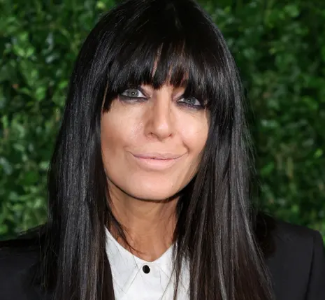
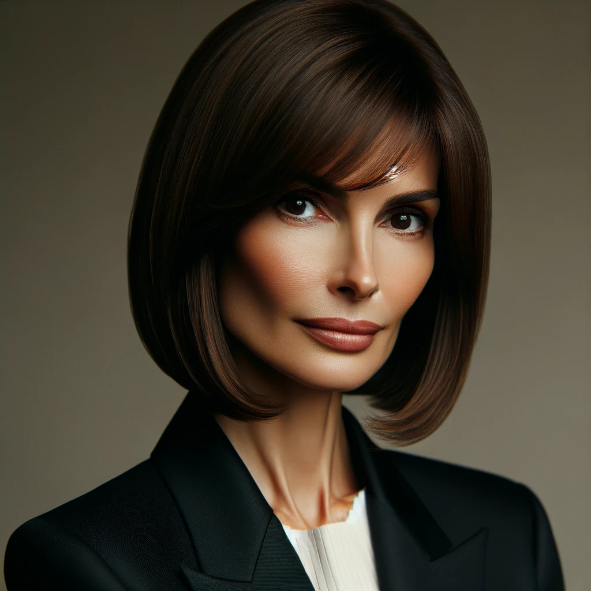
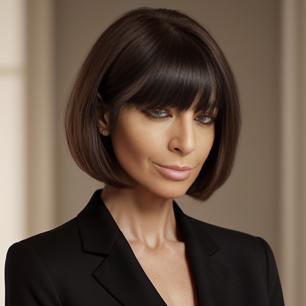
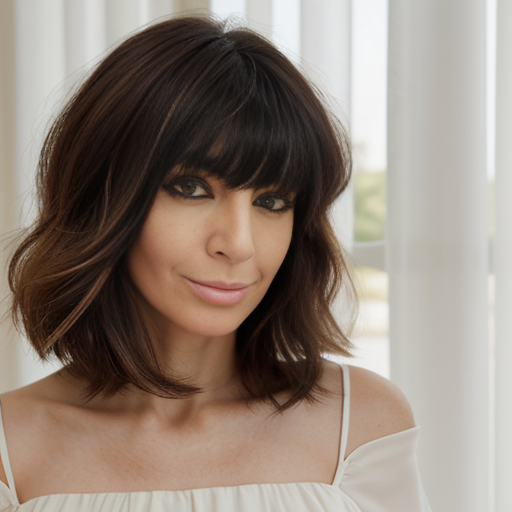

## Analysis with ChatGPT

#### Input



My client is looking for a new hair style. She is 52 years old. Please analyse her hair and provide some recommended new hair styles

#### ChatGPT Analysis

Based on the photo provided, your client has very dark, almost black hair that appears to be straight in texture. The hair is long and features a full, blunt fringe that falls just above the eyes. The hair's length is mid-way down her back, and the ends appear to be quite healthy. Her facial features include a defined jawline and cheekbones, with a face shape that can be categorized as oval.

Taking into account her age and facial features, here are three suitable hair styles and colours:

1. **Lob with Side-Swept Bangs**: A long bob (lob) would be a modern update to her look while still maintaining some length. The side-swept bangs would soften her features and add movement. This style would also be easier to maintain and could give her a youthful edge. Considering her age, a rich, chocolate brown color could add warmth to her complexion.

2. **Layered Shoulder-Length Cut with Curtain Bangs**: Adding layers would give her hair more volume and the illusion of movement. Curtain bangs would frame her face beautifully, highlighting her cheekbones and eyes. This style maintains a youthful look without being too drastic of a change. The color could be a soft black with subtle highlights to add dimension.

3. **Soft Pixie Cut**: If she's looking for a more dramatic change, a soft pixie cut could be very flattering, especially with her well-defined facial structure. It would be a low-maintenance style that can be sophisticated and chic. A color suggestion would be a soft black or deep brown, keeping it natural with potential for subtle highlights to enhance the texture.

Now, I'll create stable-diffusion prompts for each recommended hairstyle to demonstrate them on a person with the same age, facial features, body type, setting, and camera type as in the supplied image.

1. **Lob with Side-Swept Bangs Prompt**:
```
{
  "prompt": "A woman in her early 50s with an oval face and defined cheekbones, photographed in a formal setting with natural lighting. She has a sophisticated lob haircut just above the shoulders with side-swept bangs. Her hair color is a rich chocolate brown with a smooth texture, and she wears a smart black blazer over a white shirt."
}
```

2. **Layered Shoulder-Length Cut with Curtain Bangs Prompt**:
```
{
  "prompt": "A woman in her early 50s with an oval face, photographed with a professional depth-of-field camera effect. She has a vibrant shoulder-length layered haircut with soft curtain bangs framing her face. Her hair color is a soft black with subtle highlights to showcase the layers, complementing her formal attire in a natural setting."
}
```

3. **Soft Pixie Cut Prompt**:
```
{
  "prompt": "A sophisticated woman in her early 50s with a strong jawline, posing in an elegant environment. She sports a chic soft pixie cut that enhances her facial features, with a natural hair color of deep brown and subtle highlights. The image captures the shine and texture of her hair, complemented by her elegant black outfit."
}
```

Let's proceed with generating the image for the first hairstyle recommendation: the lob with side-swept bangs.

Here is a visual representation of the first hairstyle recommendation, a lob with side-swept bangs, in a rich chocolate brown color. The style is demonstrated on a woman who has similar facial features and is in the same age range as your client. If this resonates with her, you can consider this as a fresh new look. Would you like to proceed with the visuals for the next hairstyle recommendations?

]

## Stable Diffusion Output

### **Lob with Side-Swept Bangs Prompt**

A woman in her early 50s with an oval face and defined cheekbones, photographed in a formal setting with natural lighting. She has a sophisticated lob haircut just above the shoulders with side-swept bangs. Her hair color is a rich chocolate brown with a smooth texture, and she wears a smart black blazer over a white shirt.

]

### Layered Shoulder-Length Cut with Curtain Bangs Prompt

#### Photo 1

A woman in her early 50s with an oval face, photographed with a professional depth-of-field camera effect. She has a vibrant shoulder-length layered haircut with soft curtain bangs framing her face. Her hair color is a soft black with subtle highlights to showcase the layers, complementing her formal attire in a natural setting.




#### Photo 2

A woman in her early 50s with an oval face,photographed with a professional depth-of-field camera effect. She has a vibrant shoulder-length layered haircut with soft curtain bangs framing her face. Her hair color is a soft black with subtle highlights to showcase the layers,complementing her formal attire in a coffee shop setting,dim lighting,nighttime,

!(20240209101921.png)


#### Photo 3

A woman in her early 50s with an oval face,photographed with a professional depth-of-field camera effect. She has a vibrant shoulder-length layered haircut with soft curtain bangs framing her face. Her hair color is a soft black with subtle highlights to showcase the layers,complementing her casual attire,urban street,rainy day,

!(20240209102209.png)

### Soft Pixie Cut Prompt

A sophisticated woman in her early 50s with a strong jawline, posing in an elegant environment. She sports a chic soft pixie cut that enhances her facial features, with a natural hair color of deep brown and subtle highlights. The image captures the shine and texture of her hair, complemented by her elegant black outfit.

!(20240209101620.png)
